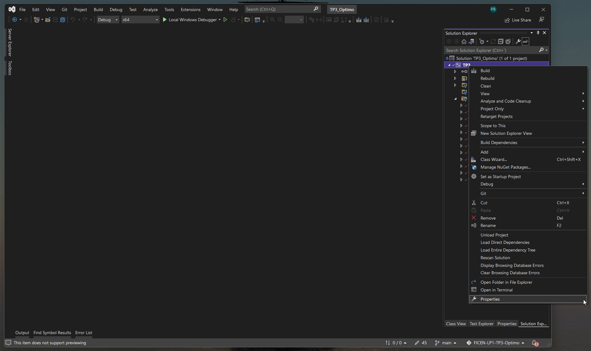
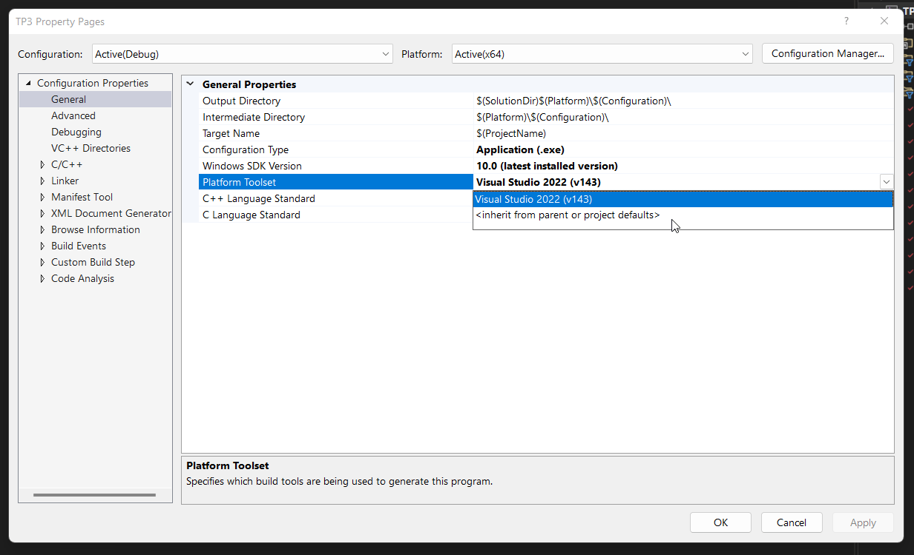

# TP3 - Resolución Óptima 

#### [[PDF] ENUNCIADO TP3]([ENUNCIADO]%20TP3%20LP1%20-%202022.pdf)
#### [[PDF] UML TP3]([UML]%20TP3.pdf)

---
#### ⚠️INFORMACIÓN IMPORTANTE⚠️ 
    Este TP fue desarrollado usando Visual Studio 2022

> Visual Studio 2019 o anterior

1. Ir a Proyecto y luego hacer click en Propiedades

2. Hacer click en Platform Toolset y seleccionar su versión de Visual Studio

        Visual Studio 2015: v140
        Visual Studio 2017: v141
        Visual Studio 2019: v142
        Visual Studio 2022: v143
    

[Documentación MSDN - How to: Modify the Target Framework and Platform Toolset](https://docs.microsoft.com/en-us/cpp/build/how-to-modify-the-target-framework-and-platform-toolset?view=msvc-170)

---

UF-FICEN Laboratorio de Programación I - 2022 1er Cuatrimestre
